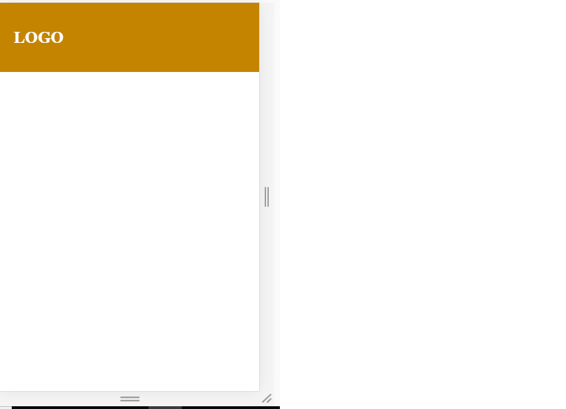
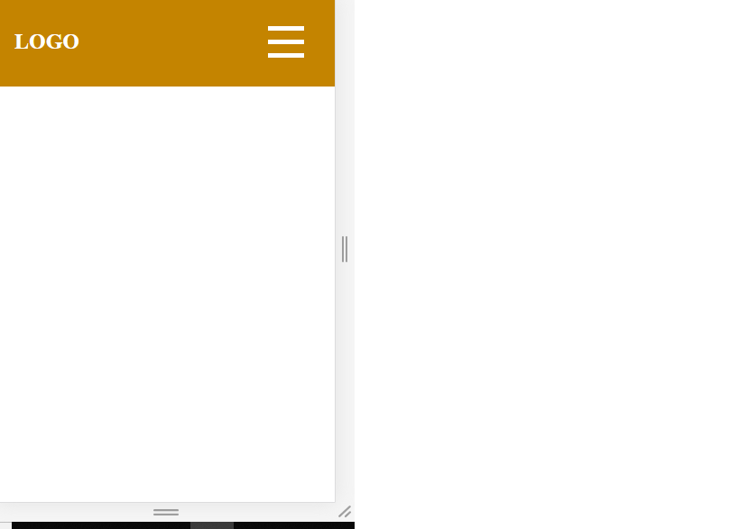
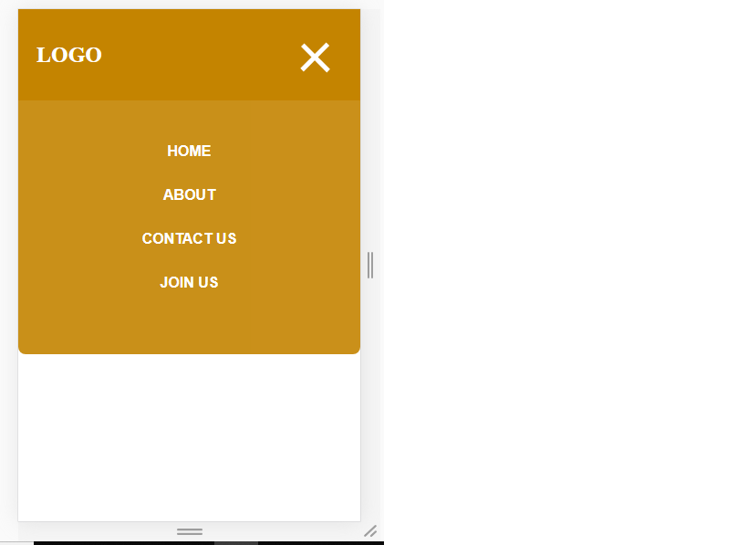

This is the [Live Demo](https://taiwrash.github.io/jsminnainternship/task-one) of the app and [Full Code](https://github.com/Taiwrash/jsminnainternship/tree/main/task-one).

## What is Responsive Web Design (RWD)?

Creating a web based application that can be assessed on almost all the screen sizes ranging from desktop, laptop, tablet and mobile screen sizes is very important this day as there a variety of device screen sizes in the tech device industries. This can be made possible through the web design concept known as `Responsive Web Design (RWD)`. Also, there are numerous of doing this but we will be focusing everything in this article on `CSS`.

## What is CSS?

CSS is an abbreviation of `Cascading Style Sheet` which is the set of rules that give styles ranging from layouts, colours, type representation and other tons of css property that is related to design to the point of animations.

## What is Mobile Navigation?

A provision for mobile users to interact with an application navigation due to the constraint caused by the device screen sizes.

# Getting Started with Responsive Mobile Navigation

## Mark Up of the Nav

```
    <nav>
      <div class="logo"><h1>Logo</h1></div>
      <div class="anchors">
        <ul>
          <li><a href="#">Home</a></li>
          <li><a href="#">About</a></li>
          <li><a href="#">Contact Us</a></li>
          <li><a href="#">Join Us</a></li>
        </ul>
      </div>
      <div class="harmburg">
        <div class="line1"></div>
        <div class="line2"></div>
        <div class="line3"></div>
      </div>
    </nav>
```

Above is the exact HTML snippet which will serve as our `nav` area of the application we are building. see more breakdown of the above below.

- Line 1

NAV: An element from HTML5 syntax which help in help in web `accessibilities`. This inform the user browser that the nav area is a navigation menu area.

- Line 2

This is the div which house the logo of our application or any other thing we intends to appear at left hand corner of our applications.

- Line 3 - 10

A div which house all our anchor links `navigation links`. The nav links are listed using the unorder list <ul> element of HTML.

- Line 11 - 15

Contain the harmburger <divs>. Harmburger is a three or two lines usually on mobile when clicked give a list of the nav links on real life mobile app you've ever interacted with.

- That is all for our HTML codes, next is the css which is the main focus of this article.

## Time to style the HTML code written

- Clearing Default Style

I will be taking one element at a time for simplicity and straight forward process especially for begginers reading this post.

```
        * {
    padding: 0;
    margin: 0;
    box-sizing: border-box;
    }
```

This is purposely to remove the default margin and padding of every element and to set the box-sizing to border-box which controls behaviour activities of every elements on the page. This prevent default addition of margin and padding to the width and height.

- Styling the Nav

```
    nav {
    background-color: #b8860b;
    width: 100%;
    height: 100px;
    display: flex;
    flex-direction: row;
    justify-content: space-between;
    align-items: center;
    }
```

Above is snippet which style the nav for all users from desktop to tablet users. The display flex property is a `CSS 2.1` and new version property that help in RWD and give simplicity for our projects. It is easy to learn. Try reading more on it. `space-between` value on the `justify-content` create equal space in all the `flex-items`. Let's take note here that we can start Responsive Web Design from any design pattern and the best practice is to choose `Mobile First` pattern in which mobile style are written first but also desktop can also be done first, so we are starting from desktop here.

```
    .logo {
    color: #ffffff;
    margin: 0 20%;
    text-transform: uppercase;
    z-index: 3;
    }
    ul li {
    list-style: none;
    display: inline;
    font-weight: bold;
    font-family: sans-serif;
    }

    ul li a {
    text-decoration: none;
    color: #ffffff;
    text-transform: uppercase;
    padding: 0 10px;
    }

    ul li a:hover {
    color: #f1ae03;
    }
```

Above are the remaining snippet to have something like the image below. Explaining this below the scope of the articles. I just assumes you can understand what it does as it is the style for the logo look and default style of some elements were removed and other property values were specified.

### Here we are, amazing right?

If you are following with the same snippets, you should have below beautiful yellow and white navigation bar.


## Not to loose focus, Let's design for mobile

As discussed in the beginning of this article that RWD can be carried out using many techniques. Yes, it is true and we will be using `media query` technique in this article as it is the one of the simplest way of making a responsive design. Below is the snippet of a media query approach.

```
    @media screen and (max-width: 768px) {
        /* Note: Every code from now on, runs here */
    }
```

`@media` is the first command to call media query into action, the `screen` is to specified the type of action we want our media query to do as it can also be `print` if we intend to give a certain property when our pages needs to be print. The `and` it is a conjuction to add another crucial property in this case the width of the device we are designing for. We choose `768px` as anything below the tablet screen size will get our css rules inside the media query applied.

- Styling the <div> links in mobile.

Inside the media query opening and closing tags we start the styling.

```
    .logo {
        margin: 0 20px;
    }
    .anchors {
        display: none;
        background-color: #b8860b;
        height: 300px;
        min-width: 100%;
        justify-content: center;
        align-items: center;
        margin: auto;
        z-index: 2;
        position: absolute;
        top: 5%;
        opacity: 0.9;
        border-radius: 0 0 0.5em 0.5em;
        text-align: center;
    }
```

The logo margin was reset to new values in all the screen size below 768px as indicated in the our media query command. `.anchors` is a class attributes of the element that contains all the nav links. We specialize property and it was position absolute to escape the user screen view.

```
 .anchors ul li {
    display: block;
    margin: 30px 0;
  }
```

The display property of list items was change to them display vertically.


## Let's Create the Harmburger.

Taking closer look at our html a <div> with a class attribute of `harmburg` was dedicated to the harmburger section which consist of three separate <divs>. Each separate represent each lines of the harmburger.

- For easy control, the parent <div> will the below properties

```
 .harmburg {
    z-index: 4;
    width: 80px;
    height: 80px;
    position: absolute;
    left: 75%;
    display: flex;
    flex-direction: column;
    align-items: center;
    justify-content: center;
  }
```

The above, create a section for the harmburger elements to not exceed.

- Next is drawing the harmburger lines

```
  .line1,
  .line2,
  .line3 {
    width: 40px;
    height: 5px;
    background-color: #ffffff;
    margin: 5px 0;
    transition: 0.5s;
  }
```

The above draw a three lines and we have something like below image.



## How will it toggle

```
 .toggle .line1 {
    transform: rotate(-45deg) translate(-9px, 15px);
  }
  .toggle .line2 {
    opacity: 0;
  }
  .toggle .line3 {
    transform: rotate(45deg) translate(-5px, -12px);
  }
```

The above created snippet will do nothing just yet. The remaining parts we done using simple vanilla javascript to call the toggle.

## Simple Script Section.

It is the most simple script, you can ever think of. See below.

```js

const harmb = document.querySelector(".harmburg");
const navItems = document.querySelector(".anchors");
```

Both harmburger <div> and the <div> which contain the nav links was brought to DOM for DOM manipulations.

```js
    harmb.addEventListener("click", () => {
    if (navItems.style.display == "" || navItems.style.display == "none") {
        harmb.classList.toggle("toggle");
        navItems.style.display = "flex";
    } else {
        harmb.classList.toggle("toggle");
        navItems.style.display = "none";
    }
    });
```

An event was set on the harmburger to listen for a `click` , click is an event in javascript which respond to mouse click on desktop, laptop and tapping on android do the same.

An if statement was created to check if certain conditions met, in this case, if the display value of anchor <div> is not none or the `display` value is `none`. So, if any happens, toggle happens and add the last part of our css to the harmburger element and the <div> element is set to display of flex and if conditions not met the toggle set and nav div links dissappear through the help of display none css property.



## Conclusion

This is how simple to create a responsive mobile navigation with no help of a CDN, frameworks or libraries. This gives a full control of your design and prevent buddling and make your pages load fast. Using CDN, libraries and frameworks always make a request to an external packages which slow down web loading. With this, you've not only designed a mobile responsive navigation for your app but also designed a very fast loading application.

### Wish you success on your next project.
